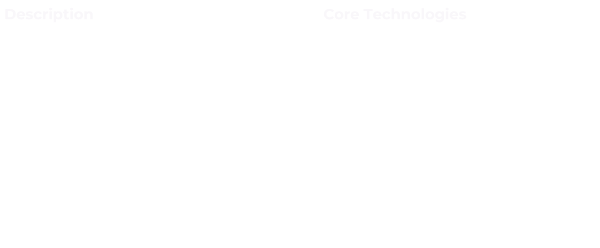

## 🤖 Tools and Technologies

  
  
  

<!-- BIO -->

## :art: Bio

Software engineer with a background in consultative sales, and a deep-seated passion for music.

My professional experience revolves around collaborating with clients and team members to tackle complex challenges head-on, crafting novel solutions, and bringing ideas to fruition. Inspired by my love for music composition, my approach to software design and development emphasizes clarity and elegance, translating abstract concepts into practical, impactful solutions.

<!-- Featured Project -->
## :star2: Featured Project

<!-- Project Details -->

<!-- Contact Info -->

## 💬 Get In Touch

<!-- OTHER INFO -->

🌄 My journey into tech

#### 🎇 The Spark

Picture me at 14, in a computer tech class, eyes glued to the screen, soaking in every word from the teacher. The task? To program a small remote-controlled vehicle to navigate a figure eight. It took a bit of head-scratching, maybe a little more than a bit, but when it finally zipped through the course on its own, it felt like witnessing magic. That's the moment my love affair with software engineering ignited.

#### 👷‍♂️ Navigating Trades

Life's currents swept me straight from high school into the workforce. Following my older brother's lead, I dove into roofing, learning the ropes as an installer and eventually gearing up for a leadership role as foreman. But dreams, they're funny creatures. Sometimes they get obscured in the everyday hustle. So, I made a pivot into sales, diving headfirst into the world of digital marketing at a startup called MyFitCoach. It was a rollercoaster ride - a few loops, a couple of hairpin turns, and an unexpected stop when the startup hit a dead end.

Undeterred, I switched gears yet again, this time joining the Glaziers union, working in curtain wall manufacturing. Crafting glass structures from blueprint to installation was rewarding, but the itch for something more persisted.

#### 💼 Back to Sales

Back to the drawing board, back to sales. Armed with stacks of books and a thirst for knowledge, I embarked on a journey that led me to HomeAdvisor and eventually to ADT Security Service. The thrill of being recognized as rookie of the month in the Northeast was exhilarating, but beneath the surface, a quiet voice urged me to explore a path that resonated deeper within.

#### 🌄 The Leap

And so, I embarked on a journey of self-discovery. Personality tests, deep introspection, and a sprinkle of meditation revealed what my heart had known for years - software engineering wasn't just a career choice; it was my calling. With newfound clarity, I took the leap and applied to Flatiron School, a beacon of learning in the realm of full-stack development.

The boot camp was no walk in the park, but with grit and determination, I conquered each challenge. Post-graduation, the road to securing an entry-level position proved rocky, marked by rejections and setbacks. But amidst the storm, the silver lining shone bright - I was pursuing my passion, honing skills that would shape not just my career, but my entire life's trajectory.

#### 🚀 TeleCAIN and Beyond

Then came TeleCAIN, a pivotal chapter in my journey. Collaborating with an exceptional team, we brought ChatrrApp to life, etching our mark in the annals of tech history.

And the adventure continues, fueled by a relentless drive to innovate, to create, and to build - whether it's for an organization or for my own aspirations. Because in the end, it's not just about the job title or the paycheck; it's about the joy of crafting something meaningful, something that leaves a lasting impact. And that, my friend, is what keeps me going.

🏆 My proudest achievement

#### 📱 ChatrrApp

At TeleCAIN, my proudest achievement was guiding the front-end of ChatrrApp from concept to its launch on the Google Play Store in Trinidad and Tobago. The most rewarding phase of this endeavor was seamlessly integrating it with a complex backend VoIP Infrastructure, specifically utilizing Kamilio/FreeSWITCH. I meticulously approached this integration in two primary phases, each requiring meticulous research, system design, problem-solving, and precise execution.

#### 🔍 Research and Proposal Phase:

Initially, I embarked on comprehensive research to explore potential solutions for integrating the front-end application with the intricate backend VoIP Infrastructure. This involved delving into various system architectures and meticulously drafting three possible proposals. These proposals were then presented to the team for collective discussion and decision-making.

After thorough deliberation, we unanimously agreed to leverage JsSIP and React Native WebRTC on the client side. JsSIP served as the cornerstone for establishing and terminating SIP sessions, while React Native WebRTC facilitated peer-to-peer media exchange and streamlined media stream management. Overcoming the challenge of JsSIP's native browser reliance in a mobile environment required strategic polyfilling to seamlessly integrate the library into the React Native framework.

#### 💻 Development Phase:

With a solid foundation laid in the research phase, I proceeded to design and develop the client-side SIP architecture. Adopting an object-oriented programming (OOP) approach, I implemented a facade design pattern comprising a series of decoupled singleton services catering to both audio and video calls. These services included:

- __DebuggingService:__ Integrated with Sentry and Google Analytics for comprehensive reporting, this service also incorporated Firebase remote config plugins to enable remote activation. Its rich, color-coded tabular logs, supported by node utils, became invaluable for internal debugging purposes.
- __RTCStreamManager:__ Leveraging React Native WebRTC APIs, this service managed media streams, facilitating functionalities such as stream capture, muting/unmuting audio and video, and camera switching.
- __CallLoggingService:__ Responsible for tracking calls and logging and recording call outcomes in the database.
- __RemoteMessagingService:__ Designed to process FCM remote messages in all states, this service was engineered to be highly extensible, allowing for seamless integration of new EventEmitterService: Facilitated event-driven communication within the application.

Additionally, I developed an RTCTransponder to relay SIP events and data to subscribers, ensuring smooth intercommunication between the decoupled services and wider React Native context. Decoupling VoIP services from React Context extended VoIP operations throughout the application lifecycle and enabled operation in headlessJS.

To simplify complex functionality, I exposed sophisticated SIP and WebRTC services through a simplified facade pattern via a high-level class named "VoIP." This abstraction streamlined interaction with VoIP services and enabled seamless integration with React Context through a single custom hook.

Centralized VoIP call state management was realized through the implementation of Redux, ensuring efficient tracking and control of call-related data throughout the application. Additionally, to streamline app-wide side effect management and circumvent prop drilling within nested components, a custom context was developed. This custom context not only facilitated seamless communication between components but also supported advanced functionalities such as event-driven programmatic navigation, enhancing the overall user experience.

Furthermore, I meticulously optimized SIP timers by patching the JsSIP library, drawing upon insights from RFC 3261 to ensure support for call suspension functionality. Additionally, I engineered custom Java activities to deliver immersive full-screen incoming call notifications. Crafting bespoke Expo config plugins allowed for seamless modification of Android configurations and execution of build scripts, enabling effortless integration with Android connection services and leveraging FCM for comprehensive call suspension and delivery functionality across all application states. Moreover, the integration of Notifee elevated the user experience with its provision of rich, user-friendly notifications, contributing to an enhanced overall experience.

#### 🎉 Conclusion

By meticulously navigating through these phases, from research and proposal to development and implementation, I not only achieved the successful integration of the front-end application with complex backend VoIP Infrastructure but also contributed to enhancing its functionality, performance, and user experience.

While this endeavor was challenging, it was undeniably rewarding and stands as a testament to my ability to lead front-end development within a collaborative team environment. Successfully guiding the front-end development of ChatrrApp from concept to its debut on the Google Play Store, alongside seamlessly integrating it with a complex backend VoIP Infrastructure, exemplifies my dedication to meticulous research, problem-solving, and precise execution. This achievement showcases my proficiency in driving development while collaborating with other engineers across various elements of the stack, as well as my unwavering commitment to delivering exceptional outcomes.

💻 I'm currently working on

#### 🤓 Here's what's keeping me busy:

- __LeetCode 75:__ I've completed several courses on data structures and algorithms, tackled 100 problems on AlgoExpert, and I'm currently wrapping up the LeetCode 75 before diving into the LeetCode top 150 interview question list.

- __Interview Prep:__ I've been diligently reviewing hundreds of pages of notes covering everything from web to mobile development. Preparation is key, and I'm leaving no stone unturned to ensure I'm ready for any challenge.

- __Networking:__ Collaboration and mentorship are invaluable, so I'm actively engaging with my career coach and mentors to craft and execute an effective networking strategy. Building meaningful connections is essential in today's professional landscape.

- __Personal Branding:__ Crafting a strong digital presence with a focus on personal branding is crucial. I'm dedicated to showcasing my skills, experiences, and unique value proposition across various online platforms, establishing myself as a reputable and recognizable figure in the industry.

These endeavors keep me engaged and motivated as I strive for continuous growth and development in my career journey.

📖 I'm currently learning

#### 📝 HarvardX CS50: Introduction to Computer Science

Currently, I'm enrolled in HarvardX's CS50: Introduction to Computer Science. This course allows me to delve into C and low-level programming during my weekends, strengthening my foundational knowledge in the field.

#### 🔬 Topics:

- A broad and robust understanding of computer science and programming
- How to think algorithmically and solve programming problems efficiently
- Concepts like abstraction, algorithms, data structures, encapsulation, resource management, security, software engineering, and web development
- Familiarity with a number of languages, including C, Python, SQL, and JavaScript plus CSS and HTML
- How to engage with a vibrant community of like-minded learners from all levels of experience
- How to develop and present a final programming project to your peers

